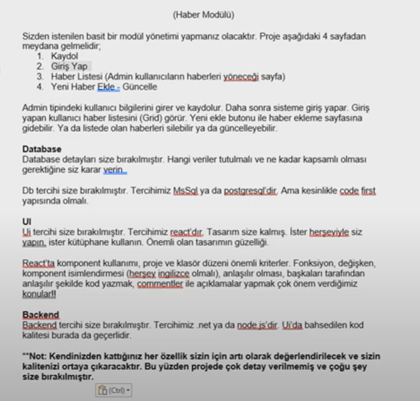

# News Module



## Running the Project
```
$ docker-compose up -d
```

## Project Data
- Backend: [localhost:13001](https://localhost:13001)
- Frontend: [localhost:80](https://localhost:80)
- Sql Server: [1433](https://localhost:1433)
  - SA: sa
  - Password: Password12*
- SqlPad: [localhost:400](https://localhost:4000)
  - SQLPAD_ADMIN: admin@enginyenice.com
  - SQLPAD_ADMIN_PASSWORD: Password12*


